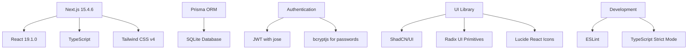

# Project Overview

## Current Implementation Status

GoCMS is currently in development with core CMS functionality implemented. The system provides a foundation for creating and managing business websites with controlled content editing capabilities.

### Implemented Features

- ✅ **User Authentication System** - JWT-based login/signup
- ✅ **Database Schema** - Complete Prisma models for pages, blocks, and users
- ✅ **Admin Dashboard** - Statistics and overview interface
- ✅ **Page Management** - CRUD operations for website pages
- ✅ **Block-based Content** - Template system with configurable fields
- ✅ **Page Rendering** - Dynamic content rendering with templates
- ✅ **UI Framework** - ShadCN/UI components with Tailwind CSS
- ✅ **Dark Mode Support** - Theme switching capability
- ✅ **Middleware Protection** - Route protection for admin areas

### Technology Stack



## Project Structure

```
gocms/
├── src/
│   ├── app/                    # Next.js App Router
│   │   ├── admin/             # Protected admin interface
│   │   │   ├── layout.tsx     # Admin layout with sidebar
│   │   │   ├── page.tsx       # Dashboard
│   │   │   └── pages/         # Page management
│   │   ├── api/               # API routes
│   │   │   └── pages/         # Page CRUD operations
│   │   ├── login/             # Authentication pages
│   │   ├── signup/
│   │   ├── [slug]/            # Dynamic public pages
│   │   └── actions/           # Server actions
│   ├── components/            # Reusable components
│   │   ├── admin/             # Admin-specific components
│   │   ├── auth/              # Authentication forms
│   │   └── ui/                # ShadCN/UI components
│   ├── lib/                   # Utility libraries
│   │   ├── auth.ts            # JWT session management
│   │   ├── db.ts              # Database utilities
│   │   ├── password.ts        # Password hashing
│   │   └── user.ts            # User management
│   └── middleware.ts          # Route protection
├── prisma/
│   ├── schema.prisma          # Database schema
│   ├── seed.ts               # Database seeding
│   └── migrations/           # Database migrations
└── docs/                     # Technical documentation
```

## Architecture Principles

### 1. Controlled Design Philosophy

- **Developer Control**: Complete control over layout, styling, and structure
- **Client Safety**: Clients can only modify predefined content fields
- **No Structural Editing**: Prevents clients from breaking site design
- **Template-Based**: HTML templates with placeholder replacement

### 2. Block-Based Content System

Content is organized into blocks with:
- **Type**: Defines the block's purpose (hero, bio, gallery, etc.)
- **Template**: HTML structure with placeholder variables
- **Fields**: Configurable content areas (text, images, links)
- **Order**: Determines display sequence on pages

### 3. Security-First Authentication

- **JWT Sessions**: Stateless authentication with HttpOnly cookies
- **Password Hashing**: bcryptjs with 12 salt rounds
- **Route Protection**: Middleware-based access control
- **Server-Only Functions**: Sensitive operations isolated to server

### 4. Performance Optimization

- **SQLite for Development**: Fast local database setup
- **Efficient Queries**: Optimized database operations with Prisma
- **Modern Stack**: Latest React and Next.js features
- **TypeScript**: Compile-time error prevention

## Database Design

The system uses a relational model with:

- **Pages**: Website pages with metadata and publishing status
- **Blocks**: Content modules within pages with templates
- **BlockFields**: Individual editable fields within blocks
- **Users**: Authenticated administrators
- **Settings**: Site-wide configuration options

See [Database Schema](./03-database-schema.md) for detailed information.

## Development Status

### Current Capabilities

1. **Content Management**: Create, edit, and manage website pages
2. **User Management**: Admin user registration and authentication
3. **Template Rendering**: Dynamic page generation from templates
4. **Admin Interface**: Dashboard with statistics and management tools

### Areas for Future Development

1. **File Upload System**: Image and media management
2. **Advanced Block Types**: Rich content blocks (galleries, forms)
3. **Multi-Site Support**: Managing multiple client websites
4. **SEO Optimization**: Meta tags and structured data
5. **Content Versioning**: Page history and rollback capabilities

## Next Steps

The immediate development priorities are:

1. Implement file upload and media management
2. Expand block types and field options
3. Add page preview functionality
4. Implement site settings management
5. Create deployment and production setup guides