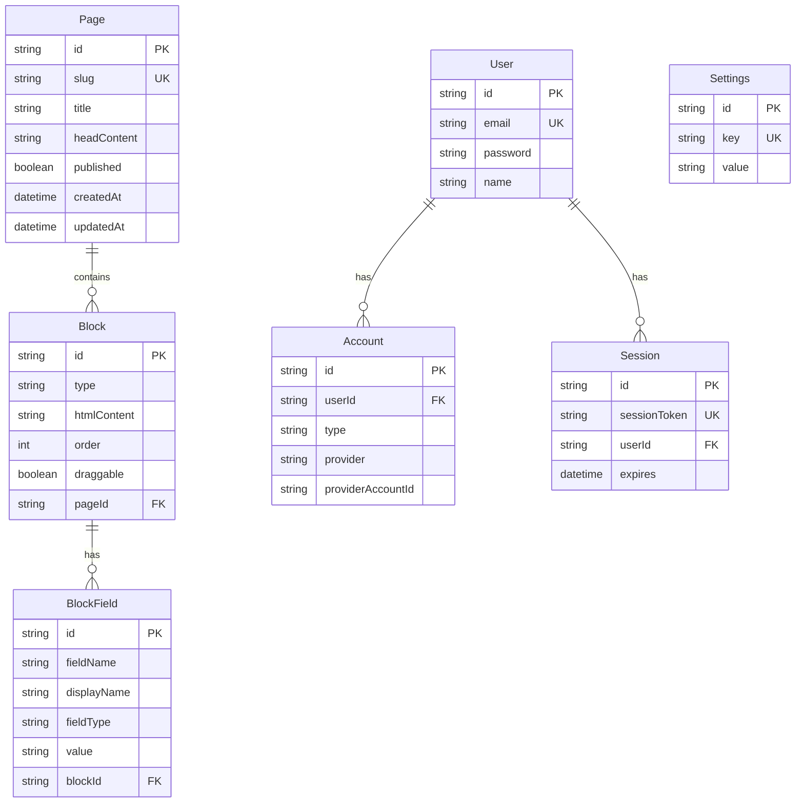
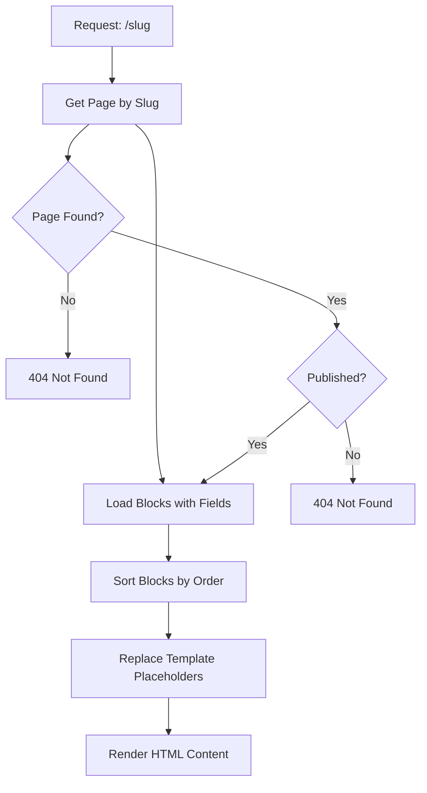

# Database Schema

## Overview

GoCMS uses a relational database structure built with Prisma ORM. The schema is designed to support flexible content management while maintaining data integrity and performance.

## Entity Relationship Diagram



## Core Models

### Page Model

Represents website pages that can be published or kept as drafts.

```prisma
model Page {
  id           String   @id @default(cuid())
  slug         String   @unique
  title        String
  headContent  String?  // Custom <head> content
  blocks       Block[]
  published    Boolean  @default(false)
  createdAt    DateTime @default(now())
  updatedAt    DateTime @updatedAt
}
```

**Key Features:**
- **Unique Slug**: Used for URL routing (`/slug`)
- **Head Content**: Custom HTML for page `<head>` section
- **Publishing Status**: Controls public visibility
- **Automatic Timestamps**: Creation and update tracking

### Block Model

Content modules within pages that define structure and layout.

```prisma
model Block {
  id          String      @id @default(cuid())
  type        String      // Block identifier (e.g., "hero", "bio")
  htmlContent String      // HTML template with placeholders
  order       Int         // Display order on page
  draggable   Boolean     @default(false)
  pageId      String
  page        Page        @relation(fields: [pageId], references: [id], onDelete: Cascade)
  fields      BlockField[]

  @@map("blocks")
}
```

**Key Features:**
- **Type System**: Categorizes block functionality
- **HTML Templates**: Contains HTML with `{{placeholder}}` syntax
- **Ordering**: Determines display sequence
- **Draggable Flag**: Controls admin reordering capability
- **Cascade Delete**: Removes blocks when page is deleted

### BlockField Model

Individual editable content areas within blocks.

```prisma
model BlockField {
  id          String @id @default(cuid())
  fieldName   String // Internal identifier (e.g., "hero-1", "main_title")
  displayName String // Human-readable label for admin interface
  fieldType   String // "text", "textarea", "image", "link"
  value       String // Actual content value
  blockId     String
  block       Block  @relation(fields: [blockId], references: [id], onDelete: Cascade)

  @@map("block_fields")
}
```

**Field Types:**
- **text**: Single-line text input
- **textarea**: Multi-line text input
- **image**: Image URL or file reference
- **link**: URL with optional link text

### User Model

Administrative users with system access.

```prisma
model User {
  id       String    @id @default(cuid())
  email    String    @unique
  password String?
  name     String?
  accounts Account[]
  sessions Session[]
}
```

**Authentication Features:**
- **Unique Email**: Primary identifier for login
- **Hashed Password**: bcryptjs with 12 salt rounds
- **Optional Name**: Display name in admin interface

### Settings Model

Site-wide configuration storage.

```prisma
model Settings {
  id    String @id @default(cuid())
  key   String @unique
  value String

  @@map("settings")
}
```

**Usage Examples:**
- `site_title`: Website name
- `site_description`: Meta description
- `contact_email`: Admin contact information

## Database Utilities

### Core Functions

The system provides utility functions in `/src/lib/db.ts`:

```typescript
// Page operations
export async function getPageBySlug(slug: string)
export async function getAllPages()

// User operations  
export async function getUserByEmail(email: string)

// Settings operations
export async function getSetting(key: string)
export async function setSetting(key: string, value: string)
```

### Query Examples

**Get published page with blocks:**
```typescript
const page = await prisma.page.findUnique({
  where: { slug: 'about' },
  include: {
    blocks: {
      include: { fields: true },
      orderBy: { order: 'asc' }
    }
  }
})
```

**Update block field values:**
```typescript
await prisma.blockField.update({
  where: { id: fieldId },
  data: { value: newValue }
})
```

## Data Flow

### Content Rendering Process



### Template System

1. **HTML Template**: Stored in `Block.htmlContent`
   ```html
   <h1>{{main_title}}</h1>
   <p>{{description}}</p>
   ```

2. **Field Values**: Stored in `BlockField.value`
   - `main_title`: "Welcome to Our Site"
   - `description`: "We create amazing websites"

3. **Rendered Output**:
   ```html
   <h1>Welcome to Our Site</h1>
   <p>We create amazing websites</p>
   ```

## Migrations

Database schema changes are managed through Prisma migrations:

```bash
# Create new migration
npx prisma migrate dev --name add_new_field

# Apply migrations
npx prisma migrate deploy

# Reset database (development only)
npx prisma migrate reset
```

## Performance Considerations

### Indexing Strategy

- **Primary Keys**: Automatic CUID indexing
- **Unique Constraints**: Email, slug, session tokens
- **Foreign Keys**: Automatic indexing for relationships

### Query Optimization

- **Include Strategy**: Load related data in single query
- **Ordering**: Database-level sorting for blocks
- **Pagination**: Implement for large datasets

### Data Validation

- **Schema Level**: Prisma enforces type safety
- **Application Level**: Additional validation in API routes
- **Client Level**: Form validation for user inputs

## Backup and Recovery

### Development (SQLite)

```bash
# Backup database file
cp prisma/dev.db prisma/backup-$(date +%Y%m%d).db

# Restore from backup
cp prisma/backup-20240101.db prisma/dev.db
```

### Production (PostgreSQL)

```bash
# Backup
pg_dump DATABASE_URL > backup.sql

# Restore
psql DATABASE_URL < backup.sql
```