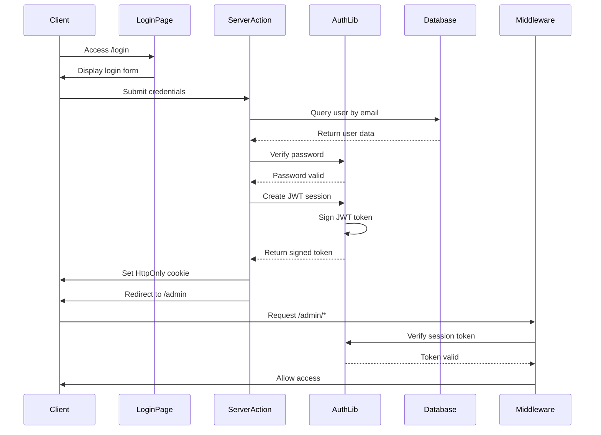

# Authentication System

## Overview

GoCMS implements a JWT-based authentication system using `jose` for token handling and `bcryptjs` for password security. The system provides stateless authentication with HttpOnly cookies for secure session management.

## Authentication Flow



## Core Components

### 1. JWT Session Management (`/src/lib/auth.ts`)

```typescript
export async function createSession(userId: string)
export async function verifySessionToken(token: string): Promise<boolean | { userId: string }>
export async function deleteSession()
```

**Key Features:**
- **7-day expiration**: Sessions automatically expire
- **HttpOnly cookies**: XSS protection
- **Secure flag**: HTTPS-only in production
- **SameSite protection**: CSRF mitigation

### 2. Password Security (`/src/lib/password.ts`)

```typescript
export async function hashPassword(password: string): Promise<string>
export async function verifyPassword(password: string, hash: string): Promise<boolean>
```

**Security Features:**
- **bcryptjs hashing**: Industry-standard password hashing
- **12 salt rounds**: High security with reasonable performance
- **Async operations**: Non-blocking password operations

### 3. User Management (`/src/lib/user.ts`)

```typescript
export async function getAuthenticatedUser()
```

**Functionality:**
- **Session validation**: Verifies JWT and user existence
- **Automatic redirects**: Redirects unauthenticated users
- **User data sanitization**: Returns safe user information

## Server Actions

### Registration Action (`/src/app/actions/auth.ts`)

```typescript
export async function registerAction(formData: FormData)
```

**Process:**
1. Extract form data (email, password, name)
2. Validate required fields
3. Check for existing email
4. Hash password with bcryptjs
5. Create user in database
6. Create JWT session
7. Redirect to admin panel

### Login Action (`/src/app/actions/auth.ts`)

```typescript
export async function loginAction(formData: FormData)
```

**Process:**
1. Extract credentials from form
2. Find user by email
3. Verify password against hash
4. Create JWT session
5. Redirect to admin panel

### Logout Action (`/src/app/actions/auth.ts`)

```typescript
export async function logoutAction()
```

**Process:**
1. Delete session cookie
2. Redirect to login page

## Route Protection

### Middleware (`/src/middleware.ts`)

```typescript
export async function middleware(req: NextRequest)
```

**Protection Strategy:**
- **Path matching**: Protects `/admin/*` routes
- **Cookie verification**: Checks session token
- **Automatic redirects**: Sends unauthenticated users to login
- **Performance optimized**: Minimal database queries

**Configuration:**
```typescript
export const config = { matcher: ['/admin/:path*'] }
```

### Page-Level Protection

Admin layout enforces authentication:

```typescript
// /src/app/admin/layout.tsx
export default async function AdminLayout({
  children,
}: {
  children: React.ReactNode
}) {
  const user = await getAuthenticatedUser() // Throws redirect if not authenticated
  
  return (
    <SidebarProvider>
      <AdminSidebar user={user} />
      {/* ... */}
    </SidebarProvider>
  )
}
```

## JWT Token Structure

### Token Payload

```json
{
  "userId": "cuid_string",
  "iat": 1640995200,
  "exp": 1641600000
}
```

### Security Configuration

```typescript
const SECRET = new TextEncoder().encode(process.env.JWT_SECRET!)
const ALG = 'HS256'
```

**Requirements:**
- **Environment variable**: `JWT_SECRET` must be set
- **Algorithm**: HMAC SHA-256 for signing
- **Encoding**: TextEncoder for proper secret handling

## Authentication Forms

### Login Form (`/src/components/auth/login-form.tsx`)

**Features:**
- **Server actions**: Direct form submission to server action
- **Error handling**: Displays authentication errors
- **Accessibility**: Proper labels and form structure
- **Styling**: ShadCN/UI components with Tailwind CSS

### Signup Form (`/src/components/auth/signup-form.tsx`)

**Features:**
- **Registration flow**: Creates new user accounts
- **Validation**: Client and server-side validation
- **Error display**: Shows registration errors
- **Redirect**: Automatic login after successful registration

## Security Considerations

### Password Security

```typescript
const saltRounds = 12 // High security, ~250ms on modern hardware
```

**Best Practices:**
- **Strong hashing**: bcryptjs with 12 rounds
- **Salt per password**: Automatic salt generation
- **Timing attack protection**: Constant-time comparisons

### Session Security

**Cookie Configuration:**
```typescript
cookieStore.set('session', token, {
  httpOnly: true,                    // XSS protection
  secure: process.env.NODE_ENV === 'production', // HTTPS only in prod
  sameSite: 'lax',                  // CSRF protection
  path: '/',                        // Site-wide access
  maxAge: 60 * 60 * 24 * 7         // 7 days
})
```

### Token Validation

**Verification Process:**
1. Extract token from cookie
2. Verify signature with secret
3. Check expiration time
4. Validate user still exists
5. Return user data or false

## Error Handling

### Authentication Errors

**Common Error Types:**
- **Invalid credentials**: Wrong email/password
- **User not found**: Email doesn't exist
- **Token expired**: Session has expired
- **Missing token**: No session cookie

**Error Response Pattern:**
```typescript
if (!isValidPassword) {
  throw new Error("Credenziali non valide")
}
```

### Redirect Behavior

**Unauthenticated Access:**
- Admin routes → Redirect to `/login`
- Login page (authenticated) → Redirect to `/admin`
- Logout action → Redirect to `/login`

## Environment Variables

### Required Variables

```env
# JWT signing secret (64+ characters recommended)
JWT_SECRET="your-super-secure-jwt-secret-key-here"

# Database connection
DATABASE_URL="file:./dev.db"

# Environment
NODE_ENV="development"
```

### Security Recommendations

**Production Setup:**
```env
JWT_SECRET="[cryptographically-secure-64-character-string]"
NODE_ENV="production"
```

**Secret Generation:**
```bash
# Generate secure random string
openssl rand -base64 64
```

## API Integration

### Protected API Routes

API routes can use the same authentication:

```typescript
import { verifySessionToken } from '@/lib/auth'

export async function POST(request: NextRequest) {
  const token = request.cookies.get('session')?.value
  const session = await verifySessionToken(token)
  
  if (!session) {
    return NextResponse.json(
      { error: 'Unauthorized' }, 
      { status: 401 }
    )
  }
  
  // Continue with authenticated logic
}
```

## Testing Authentication

### Manual Testing

1. **Registration**: Create new user at `/signup`
2. **Login**: Authenticate at `/login`
3. **Protected Access**: Try accessing `/admin` without authentication
4. **Session Persistence**: Close/reopen browser
5. **Logout**: Verify session is cleared

### Database Verification

```bash
# Check user creation
npx prisma studio

# Inspect users table
sqlite3 prisma/dev.db "SELECT * FROM User;"
```