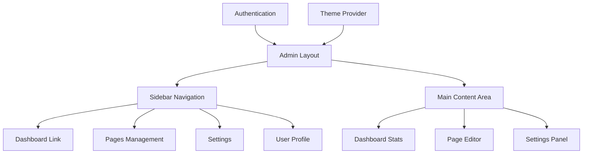
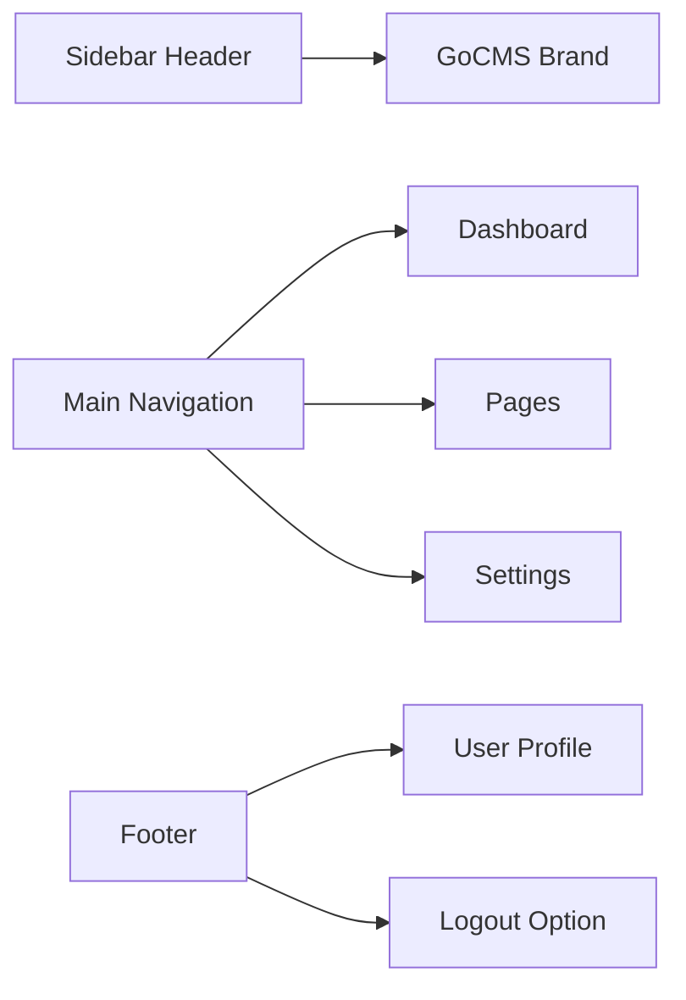

# Admin Panel

## Overview

The GoCMS admin panel provides a comprehensive interface for content management, built with ShadCN/UI components and featuring a modern sidebar navigation layout. The admin interface is protected by JWT authentication and offers real-time content editing capabilities.

## Admin Architecture



## Layout Structure

### Admin Layout (`/src/app/admin/layout.tsx`)

The admin layout provides the foundation for all admin pages:

```typescript
export default async function AdminLayout({
  children,
}: {
  children: React.ReactNode
}) {
  const user = await getAuthenticatedUser()

  return (
    <SidebarProvider>
      <AdminSidebar user={user} />
      <SidebarInset>
        <header className="flex h-16 shrink-0 items-center gap-2">
          <div className="flex items-center gap-2 px-4">
            <SidebarTrigger className="-ml-1" />
            <Separator orientation="vertical" />
            <Breadcrumb>
              {/* Breadcrumb navigation */}
            </Breadcrumb>
          </div>
        </header>
        <div className="flex flex-1 flex-col gap-4 p-4 pt-0">
          {children}
        </div>
      </SidebarInset>
    </SidebarProvider>
  )
}
```

**Key Features:**
- **Authentication Required**: All admin routes require valid user session
- **Responsive Layout**: Collapsible sidebar for mobile compatibility
- **Breadcrumb Navigation**: Context-aware navigation breadcrumbs
- **Theme Support**: Integrated with theme provider for dark/light modes

## Sidebar Navigation

### AdminSidebar Component (`/src/components/admin/admin-sidebar.tsx`)

```typescript
const adminNavItems = [
  {
    title: "Dashboard",
    url: "/admin",
    icon: LayoutDashboard,
    isActive: true,
  },
  {
    title: "Pages",
    url: "/admin/pages",
    icon: FileText,
  },
  {
    title: "Settings", 
    url: "/admin/settings",
    icon: Settings,
  },
]
```

**Components:**
- **Brand Header**: GoCMS logo and title
- **Main Navigation**: Primary admin functions
- **User Section**: Profile and logout options
- **Responsive Design**: Collapsible on mobile devices

### Navigation Features



## Dashboard

### Dashboard Overview (`/src/app/admin/page.tsx`)

The dashboard provides a comprehensive overview of site content and statistics.

```typescript
export default async function AdminDashboard() {
  const [pages, siteTitle] = await Promise.all([
    getAllPages(),
    getSetting('site_title')
  ])

  const publishedPages = pages.filter(page => page.published)
  const draftPages = pages.filter(page => !page.published)
  
  // Component rendering...
}
```

**Dashboard Features:**

#### Statistics Cards

1. **Total Pages**: Count of all pages in the system
2. **Published Pages**: Count of live pages
3. **Draft Pages**: Count of unpublished pages

#### Recent Pages Section

- Lists 5 most recently updated pages
- Shows page title, slug, and block count
- Displays publishing status with visual indicators
- Provides quick access to page editing

**Visual Elements:**
- Card-based layout for statistics
- Color-coded status indicators
- Responsive grid layout
- Lucide React icons for visual consistency

## Pages Management

### Pages List (`/src/app/admin/pages/page.tsx`)

Comprehensive page management interface with full CRUD capabilities.

```typescript
export default async function PagesPage() {
  const pages = await getAllPages()

  return (
    <div className="space-y-6">
      <div className="flex items-center justify-between">
        <div>
          <h1 className="text-3xl font-bold tracking-tight">Pages</h1>
          <p className="text-muted-foreground">Manage all your website pages</p>
        </div>
        <Button asChild>
          <Link href="/admin/pages/new">
            <Plus className="h-4 w-4 mr-2" />
            New Page
          </Link>
        </Button>
      </div>
      {/* Pages listing */}
    </div>
  )
}
```

**Features:**

#### Page Listing
- **Page Information**: Title, slug, block count, last updated
- **Status Indicators**: Published/draft status with visual cues
- **Action Buttons**: Edit and view options for each page
- **Empty State**: Helpful message when no pages exist

#### Page Actions
- **Edit**: Navigate to page editor
- **View**: Open published page in new tab
- **Create**: Add new page (button in header)

**Page Display Format:**
```typescript
<div className="flex items-center justify-between p-4 border rounded-lg">
  <div className="flex-1">
    <h3 className="font-semibold">{page.title}</h3>
    <p className="text-sm text-muted-foreground">
      /{page.slug} • {page.blocks.length} blocks • 
      Updated {page.updatedAt.toLocaleDateString()}
    </p>
  </div>
  
  <div className="flex items-center space-x-2">
    <StatusBadge published={page.published} />
    <EditButton pageId={page.id} />
    {page.published && <ViewButton slug={page.slug} />}
  </div>
</div>
```

## User Interface Components

### Navigation Components

#### AdminNavMain (`/src/components/admin/nav-main.tsx`)
- Primary navigation menu
- Active state management
- Icon integration with Lucide React

#### AdminNavUser (`/src/components/admin/nav-user.tsx`)
- User profile dropdown
- Logout functionality
- User information display

### Layout Components

#### Sidebar System
- **SidebarProvider**: Context for sidebar state
- **SidebarInset**: Main content container
- **SidebarTrigger**: Mobile menu toggle
- **Responsive Behavior**: Automatic collapse on mobile

#### Header Components
- **Breadcrumb Navigation**: Context-aware navigation
- **Separator Elements**: Visual organization
- **Trigger Controls**: Sidebar toggle functionality

## Content Management Flow

### Page Creation Workflow

```mermaid
flowchart TD
    A[Click "New Page"] --> B[Page Creation Form]
    B --> C[Enter Title & Slug]
    C --> D[Add Content Blocks]
    D --> E[Configure Block Fields]
    E --> F[Save as Draft]
    F --> G[Publish or Continue Editing]
    
    G --> H[Published Page]
    G --> I[Return to Editing]
```

### Page Editing Process

1. **Access**: Navigate to page editor from pages list
2. **Edit Content**: Modify block fields through admin interface
3. **Reorder Blocks**: Drag and drop functionality (when implemented)
4. **Save Changes**: Real-time updates via API
5. **Publish**: Toggle publishing status

## Status Indicators

### Publishing Status

**Published Pages:**
```typescript
<span className="inline-flex items-center rounded-full px-2 py-1 text-xs font-medium bg-green-100 text-green-800 dark:bg-green-900/20 dark:text-green-400">
  <Globe className="h-3 w-3 mr-1" />
  Published
</span>
```

**Draft Pages:**
```typescript
<span className="inline-flex items-center rounded-full px-2 py-1 text-xs font-medium bg-muted text-muted-foreground">
  Draft
</span>
```

### Visual Design System

**Color Coding:**
- **Green**: Published/active content
- **Yellow**: Draft/pending content
- **Muted**: Inactive/disabled states
- **Primary**: Interactive elements

**Icon Usage:**
- **Globe**: Published status
- **FileText**: Page/document related
- **Edit**: Edit actions
- **Eye**: View actions
- **Plus**: Create new content

## Responsive Design

### Mobile Adaptation

**Sidebar Behavior:**
- Desktop: Fixed sidebar with content inset
- Mobile: Collapsible overlay sidebar
- Tablet: Adaptive based on screen space

**Content Layout:**
- **Cards**: Stack vertically on mobile
- **Buttons**: Adjust size and spacing
- **Tables**: Horizontal scroll when needed

### Accessibility Features

**Keyboard Navigation:**
- Tab order follows logical flow
- Sidebar toggle accessible via keyboard
- Form elements properly labeled

**Screen Reader Support:**
- Semantic HTML structure
- ARIA labels for interactive elements
- Meaningful text alternatives for icons

## Theme Integration

### Dark Mode Support

The admin panel fully supports dark/light theme switching:

```typescript
<ThemeProvider
  attribute="class"
  defaultTheme="system"
  enableSystem
  disableTransitionOnChange
>
  {children}
</ThemeProvider>
```

**Theme-Aware Components:**
- Status badges adapt to theme
- Card backgrounds adjust automatically
- Text contrast maintained across themes
- Icon colors follow theme variables

### CSS Variables

Uses ShadCN/UI semantic color variables:
- `--background`: Main background color
- `--foreground`: Primary text color
- `--muted`: Secondary content color
- `--primary`: Interactive element color
- `--border`: Border and separator color

## Performance Considerations

### Data Loading

**Server-Side Rendering:**
- Dashboard statistics loaded on server
- Page lists pre-rendered for faster display
- Authentication check at layout level

**Optimized Queries:**
- Efficient database queries with Prisma
- Only load necessary data for each view
- Pagination planned for large datasets

### Client-Side Optimization

**Component Loading:**
- Static imports for core components
- Lazy loading for less critical features
- Minimal JavaScript bundle for admin interface

**State Management:**
- Server state for data fetching
- Local state for UI interactions
- Form state handled by browser when possible

## Future Enhancements

### Planned Features

1. **Page Editor**: Rich content editing interface
2. **Media Library**: File upload and management
3. **User Management**: Multi-user support with roles
4. **Site Settings**: Global configuration panel
5. **Analytics**: Page view statistics and insights

### UI/UX Improvements

1. **Drag and Drop**: Block reordering interface
2. **Real-time Preview**: Live page preview while editing
3. **Bulk Operations**: Multi-select for pages
4. **Search and Filter**: Enhanced page discovery
5. **Keyboard Shortcuts**: Power user features