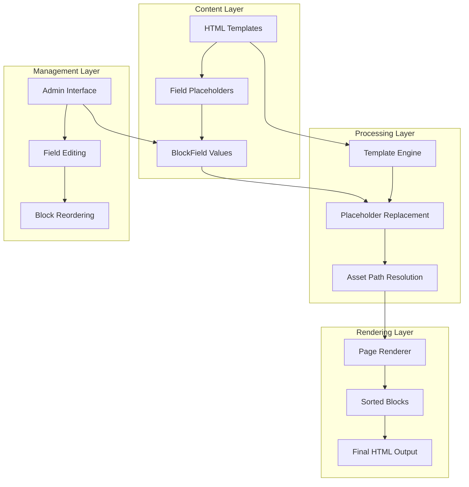

# Content System Documentation

## Overview

The GoCMS content system is built around a block-based architecture that separates content from presentation. This system allows developers to maintain complete control over design and structure while enabling clients to safely edit content within predefined boundaries.

## Core Architecture



## Template System

### HTML Templates with Placeholders

Each block contains an HTML template with placeholder syntax for dynamic content:

```html
<!-- Hero block template -->
<section class="hero-section">
    <div class="hero-content">
        <h1 class="hero-title">{{main_title}}</h1>
        <p class="hero-subtitle">{{subtitle}}</p>
        
        <a href="{{cta_link}}" class="hero-button">{{cta_text}}</a>
    </div>
</section>
```

### Placeholder Replacement Engine

The system replaces placeholders with actual content values:

```typescript
function buildPageFromTemplates(blocks: Block[], headContent: string | null, slug: string): string {
  // Sort blocks by order from database
  const sortedBlocks = [...blocks].sort((a, b) => a.order - b.order)
  
  let bodyContent = ''
  
  sortedBlocks.forEach((block) => {
    let blockHtml = block.htmlContent // Template with placeholders
    
    // Replace {{fieldName}} with actual values
    block.fields.forEach(field => {
      const placeholder = `{{${field.fieldName}}}`
      blockHtml = blockHtml.replace(
        new RegExp(placeholder.replace(/[.*+?^${}()|[\]\\]/g, '\\$&'), 'g'), 
        field.value
      )
    })
    
    bodyContent += blockHtml + '\n'
  })

  // Update asset paths for the specific page
  bodyContent = bodyContent
    .replace(/src="assets\//g, `src="/assets/${slug}/`)
    .replace(/href="assets\//g, `href="/assets/${slug}/`)

  return bodyContent
}
```

### Template Security

The template system prevents code injection:

- **Static Templates**: HTML structure is predefined and immutable
- **Content Replacement**: Only placeholder content is replaceable
- **No Script Execution**: Templates cannot execute arbitrary code
- **Safe Substitution**: Regex-based replacement prevents injection

## Block Architecture

### Block Types and Structure

#### Block Model

```typescript
interface Block {
  id: string          // Unique identifier
  type: string        // Block type (hero, bio, gallery, etc.)
  htmlContent: string // HTML template with {{placeholder}} syntax
  order: number       // Display order (1, 2, 3...)
  draggable: boolean  // Can be reordered in admin
  pageId: string      // Parent page reference
  fields: BlockField[] // Editable content fields
}
```

#### Block Types in Practice

**1. Hero Blocks**
```typescript
// Hero block example
{
  type: "hero",
  htmlContent: `
    <section class="hero">
      <h1>{{main_title}}</h1>
      <p>{{subtitle}}</p>
      
    </section>
  `,
  draggable: false, // Usually fixed at top
  fields: [
    { fieldName: "main_title", displayName: "Main Title", fieldType: "text" },
    { fieldName: "subtitle", displayName: "Subtitle", fieldType: "text" },
    { fieldName: "hero_image", displayName: "Hero Image", fieldType: "image" }
  ]
}
```

**2. Bio Blocks**
```typescript
// Bio block example
{
  type: "bio",
  htmlContent: `
    <section class="bio-section">
      <h2>{{bio_title}}</h2>
      <div class="bio-content">
        
        <div class="bio-text">{{bio_content}}</div>
      </div>
    </section>
  `,
  draggable: true, // Can be reordered
  fields: [
    { fieldName: "bio_title", displayName: "Section Title", fieldType: "text" },
    { fieldName: "portrait_image", displayName: "Portrait Image", fieldType: "image" },
    { fieldName: "bio_content", displayName: "Biography Text", fieldType: "textarea" }
  ]
}
```

**3. Gallery Blocks**
```typescript
// Gallery block example
{
  type: "gallery",
  htmlContent: `
    <section class="gallery-section">
      <h2>{{gallery_title}}</h2>
      <div class="gallery-grid">
        
        
        
        
      </div>
    </section>
  `,
  draggable: true,
  fields: [
    { fieldName: "gallery_title", displayName: "Gallery Title", fieldType: "text" },
    { fieldName: "image_1", displayName: "Image 1", fieldType: "image" },
    { fieldName: "image_2", displayName: "Image 2", fieldType: "image" },
    { fieldName: "image_3", displayName: "Image 3", fieldType: "image" },
    { fieldName: "image_4", displayName: "Image 4", fieldType: "image" }
  ]
}
```

### Block Ordering and Movement

#### Order Management

```typescript
// Block order is managed through numeric values
const moveBlock = (blockId: string, direction: "up" | "down") => {
  setBlocks(prev => {
    const currentIndex = prev.findIndex(b => b.id === blockId)
    if (currentIndex === -1) return prev
    
    const newIndex = direction === "up" ? currentIndex - 1 : currentIndex + 1
    if (newIndex < 0 || newIndex >= prev.length) return prev
    
    const newBlocks = [...prev]
    [newBlocks[currentIndex], newBlocks[newIndex]] = [newBlocks[newIndex], newBlocks[currentIndex]]
    
    // Recalculate order values
    return newBlocks.map((block, index) => ({ ...block, order: index + 1 }))
  })
}
```

#### Movement Restrictions

Blocks can only move within certain constraints:

```typescript
const canMoveBlock = (blockIndex: number, direction: "up" | "down") => {
  const block = blocks[blockIndex]
  if (!block.draggable) return false // Fixed blocks cannot move

  const targetIndex = direction === "up" ? blockIndex - 1 : blockIndex + 1
  if (targetIndex < 0 || targetIndex >= blocks.length) return false

  const targetBlock = blocks[targetIndex]
  
  // Can only move within consecutive draggable groups
  return targetBlock.draggable
}
```

## Field System

### Field Types and Validation

#### Field Model

```typescript
interface BlockField {
  id: string          // Unique identifier
  fieldName: string   // Technical field name (hero_title, main_image)
  displayName: string // Human-readable name for admin UI
  fieldType: string   // Field type (text, textarea, image, link)
  value: string       // Actual content value
  blockId: string     // Parent block reference
}
```

#### Supported Field Types

**1. Text Fields**
```typescript
{
  fieldType: "text",
  validation: {
    maxLength: 200,
    required: true
  },
  placeholder: "Enter text...",
  htmlInput: "input[type=text]"
}
```

**2. Textarea Fields**
```typescript
{
  fieldType: "textarea",
  validation: {
    maxLength: 5000,
    preserveLineBreaks: true
  },
  placeholder: "Enter longer content...",
  htmlInput: "textarea[rows=3]"
}
```

**3. Image Fields**
```typescript
{
  fieldType: "image",
  validation: {
    urlFormat: true,
    allowedDomains: ["https://"] // Only HTTPS URLs
  },
  placeholder: "https://example.com/image.jpg",
  htmlInput: "input[type=url]"
}
```

**4. Link Fields**
```typescript
{
  fieldType: "link",
  validation: {
    urlFormat: true,
    allowExternal: true
  },
  placeholder: "https://example.com/page",
  htmlInput: "input[type=url]"
}
```

### Field Validation System

```typescript
const validateField = (field: BlockField, value: string): ValidationResult => {
  const errors: string[] = []
  
  // Length validation
  const maxLength = getMaxLengthForFieldType(field.fieldType)
  if (value.length > maxLength) {
    errors.push(`Content too long (max ${maxLength} characters)`)
  }
  
  // Required field validation
  if (field.required && !value.trim()) {
    errors.push(`${field.displayName} is required`)
  }
  
  // URL validation for image and link fields
  if ((field.fieldType === 'image' || field.fieldType === 'link') && value) {
    if (!isValidUrl(value)) {
      errors.push('Invalid URL format')
    }
    
    if (field.fieldType === 'image' && !value.startsWith('https://')) {
      errors.push('Image URLs must use HTTPS')
    }
  }
  
  return {
    isValid: errors.length === 0,
    errors
  }
}
```

## Page Rendering System

### Page Renderer Component

The `PageRenderer` component (`/src/components/page-renderer.tsx`) handles the complete page rendering process:

```typescript
export function PageRenderer({ page }: PageRendererProps) {
  const containerRef = useRef<HTMLDivElement>(null)

  useEffect(() => {
    // Add page-specific CSS
    const existingLink = document.querySelector(`link[href="/css/${page.slug}.css"]`)
    if (!existingLink) {
      const link = document.createElement('link')
      link.rel = 'stylesheet'
      link.href = `/css/${page.slug}.css`
      document.head.appendChild(link)
    }
  }, [page.slug])

  useEffect(() => {
    if (!containerRef.current || page.blocks.length === 0) {
      return
    }

    // Build page from templates and field values
    const htmlContent = buildPageFromTemplates(page.blocks, page.headContent, page.slug)
    containerRef.current.innerHTML = htmlContent
  }, [page.blocks, page.headContent, page.slug])

  return (
    <div 
      ref={containerRef}
      className="min-h-screen"
      suppressHydrationWarning
    />
  )
}
```

### Asset Path Resolution

The system automatically resolves asset paths for different pages:

```typescript
// Asset path transformation
bodyContent = bodyContent
  .replace(/src="assets\//g, `src="/assets/${slug}/`)
  .replace(/href="assets\//g, `href="/assets/${slug}/`)

// Example transformation:
// Original: src="assets/images/hero.jpg"
// Result:   src="/assets/home/images/hero.jpg" (for home page)
```

### CSS Integration

Each page can have its own CSS file:

```typescript
// CSS file loading
const cssPath = `/css/${page.slug}.css`
// Loads: /public/css/home.css for home page
```

## Content Import System

### HTML Import Script

The import system converts existing HTML files into the CMS structure:

```typescript
// /scripts/import-html.ts
export async function importHtmlFile(filePath: string) {
  const htmlContent = await fs.readFile(filePath, 'utf-8')
  const dom = parse(htmlContent)
  
  // Extract page metadata
  const title = dom.querySelector('title')?.text || 'Untitled'
  const headContent = extractHeadContent(dom)
  
  // Parse blocks and fields
  const blocks = parseBlocksFromHtml(dom)
  
  // Create page in database
  const page = await prisma.page.create({
    data: {
      slug: getSlugFromFilename(filePath),
      title,
      headContent,
      published: false,
      blocks: {
        create: blocks
      }
    }
  })
  
  return page
}
```

### Block Detection

The import system detects blocks using HTML comments:

```html
<!-- BLOCK:hero:fixed -->
<section class="hero">
  <h1 data-editable="main_title">Welcome</h1>
  <p data-editable="subtitle">Subtitle text</p>
</section>
<!-- /BLOCK:hero -->

<!-- BLOCK:bio:draggable -->
<section class="bio">
  <h2 data-editable="bio_title">About Us</h2>
  <p data-editable="bio_content">Our story...</p>
</section>
<!-- /BLOCK:bio -->
```

### Field Extraction

Fields are detected using `data-editable` attributes:

```typescript
function extractFieldsFromBlock(blockElement: HTMLElement): BlockField[] {
  const fields: BlockField[] = []
  const editableElements = blockElement.querySelectorAll('[data-editable]')
  
  editableElements.forEach(element => {
    const fieldName = element.getAttribute('data-editable')
    const fieldType = determineFieldType(element)
    const value = extractFieldValue(element, fieldType)
    const displayName = generateDisplayName(fieldName)
    
    fields.push({
      fieldName,
      displayName,
      fieldType,
      value
    })
  })
  
  return fields
}
```

### Field Type Detection

```typescript
function determineFieldType(element: HTMLElement): string {
  // Image elements
  if (element.tagName === 'IMG') {
    return 'image'
  }
  
  // Link elements
  if (element.tagName === 'A') {
    return 'link'
  }
  
  // Multi-line content
  if (element.children.length > 0 || element.textContent!.includes('\n')) {
    return 'textarea'
  }
  
  // Default to text
  return 'text'
}
```

## Content Safety and Security

### Template Security

The template system provides several security layers:

1. **Immutable Structure**: HTML structure cannot be modified by content editors
2. **Placeholder Isolation**: Only specific placeholders are replaceable
3. **No Script Execution**: Templates cannot contain executable code
4. **Content Escaping**: Field values are treated as plain text or URLs

### Input Sanitization

```typescript
function sanitizeFieldValue(value: string, fieldType: string): string {
  // Basic HTML entity encoding
  let sanitized = value
    .replace(/&/g, '&amp;')
    .replace(/</g, '&lt;')
    .replace(/>/g, '&gt;')
    .replace(/"/g, '&quot;')
    .replace(/'/g, '&#x27;')
  
  // URL validation for image and link fields
  if (fieldType === 'image' || fieldType === 'link') {
    try {
      const url = new URL(sanitized)
      // Only allow HTTP/HTTPS protocols
      if (!['http:', 'https:'].includes(url.protocol)) {
        throw new Error('Invalid protocol')
      }
      return url.toString()
    } catch {
      return '' // Invalid URLs become empty strings
    }
  }
  
  return sanitized
}
```

### XSS Prevention

The system prevents XSS attacks through:

- **Template-based rendering**: No dynamic HTML generation
- **Content-only editing**: Structure remains immutable
- **URL validation**: Image and link fields validated as proper URLs
- **No innerHTML usage**: Safe DOM manipulation only

## Performance Optimization

### Efficient Rendering

```typescript
// Optimized block sorting
const sortedBlocks = useMemo(() => {
  return [...blocks].sort((a, b) => a.order - b.order)
}, [blocks])

// Memoized template building
const pageContent = useMemo(() => {
  return buildPageFromTemplates(sortedBlocks, headContent, slug)
}, [sortedBlocks, headContent, slug])
```

### Database Query Optimization

```typescript
// Single query with all related data
const page = await prisma.page.findUnique({
  where: { slug },
  include: {
    blocks: {
      include: { fields: true },
      orderBy: { order: 'asc' }
    }
  }
})
```

### Asset Loading Optimization

```typescript
// Lazy CSS loading
useEffect(() => {
  const link = document.createElement('link')
  link.rel = 'stylesheet'
  link.href = `/css/${page.slug}.css`
  link.onload = () => {
    // CSS loaded successfully
  }
  document.head.appendChild(link)
}, [page.slug])
```

## Content Versioning (Future)

### Version History Schema

```prisma
// Future version tracking
model PageVersion {
  id        String   @id @default(cuid())
  pageId    String
  version   Int
  content   Json     // Snapshot of blocks and fields
  createdBy String
  createdAt DateTime @default(now())
  page      Page     @relation(fields: [pageId], references: [id])
  
  @@unique([pageId, version])
}
```

### Backup and Restore

```typescript
// Future backup functionality
async function createPageBackup(pageId: string) {
  const page = await prisma.page.findUnique({
    where: { id: pageId },
    include: {
      blocks: {
        include: { fields: true }
      }
    }
  })
  
  return prisma.pageVersion.create({
    data: {
      pageId,
      version: await getNextVersionNumber(pageId),
      content: JSON.stringify(page.blocks),
      createdBy: getCurrentUserId()
    }
  })
}
```

## Content Migration

### Database Migrations

When adding new field types or block structures:

```sql
-- Example migration for adding new field types
ALTER TABLE block_fields ADD COLUMN field_config JSON;
UPDATE block_fields SET field_config = '{}' WHERE field_config IS NULL;
```

### Content Updates

```typescript
// Migration script for content updates
async function migrateFieldTypes() {
  const fields = await prisma.blockField.findMany({
    where: { fieldType: 'old_type' }
  })
  
  for (const field of fields) {
    await prisma.blockField.update({
      where: { id: field.id },
      data: {
        fieldType: 'new_type',
        value: transformFieldValue(field.value)
      }
    })
  }
}
```

## Development Guidelines

### Adding New Block Types

1. **Define Block Structure**:
   ```typescript
   const newBlockType = {
     type: 'custom_block',
     template: '<section>{{content}}</section>',
     fields: [
       { name: 'content', type: 'textarea', display: 'Content' }
     ]
   }
   ```

2. **Create HTML Template**:
   ```html
   <section class="custom-block">
     <div class="custom-content">{{content}}</div>
   </section>
   ```

3. **Add to Import System**:
   ```typescript
   // Add block detection pattern
   const blockPatterns = {
     custom_block: /<!-- BLOCK:custom_block(?::(\w+))? -->/
   }
   ```

### Adding New Field Types

1. **Update Field Type Enum**:
   ```typescript
   type FieldType = 'text' | 'textarea' | 'image' | 'link' | 'new_type'
   ```

2. **Add Validation Rules**:
   ```typescript
   const validationRules = {
     new_type: {
       maxLength: 1000,
       pattern: /^[a-zA-Z0-9]+$/
     }
   }
   ```

3. **Update UI Components**:
   ```typescript
   // Add input component for new type
   {field.fieldType === 'new_type' && (
     <CustomInput
       value={field.value}
       onChange={(value) => onUpdateField(field.id, value)}
     />
   )}
   ```

## Troubleshooting

### Common Issues

**Template Not Rendering**:
```typescript
// Check placeholder syntax
console.log('Template:', block.htmlContent)
console.log('Fields:', block.fields.map(f => f.fieldName))
// Ensure {{fieldName}} matches exactly
```

**Field Updates Not Saving**:
```typescript
// Verify field structure
console.log('Saving fields:', block.fields.map(f => ({
  id: f.id,
  value: f.value,
  length: f.value.length
})))
```

**Asset Paths Not Working**:
```typescript
// Check asset path resolution
console.log('Original path:', originalPath)
console.log('Resolved path:', resolvedPath)
console.log('Page slug:', pageSlug)
```

### Debug Utilities

```typescript
// Content system debugging
const debugContent = {
  logTemplate: (block: Block) => {
    console.log(`Block ${block.type}:`, {
      template: block.htmlContent,
      fields: block.fields.length,
      placeholders: (block.htmlContent.match(/\{\{[^}]+\}\}/g) || [])
    })
  },
  
  validatePlaceholders: (block: Block) => {
    const placeholders = block.htmlContent.match(/\{\{([^}]+)\}\}/g) || []
    const fieldNames = block.fields.map(f => f.fieldName)
    
    placeholders.forEach(placeholder => {
      const fieldName = placeholder.slice(2, -2)
      if (!fieldNames.includes(fieldName)) {
        console.warn(`Placeholder ${placeholder} has no matching field`)
      }
    })
  }
}
```

## Next Steps

- [Deployment Guide](./08-deployment.md)
- [Troubleshooting Guide](./09-troubleshooting.md)
- [Performance Monitoring](./10-monitoring.md)