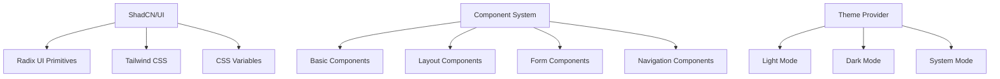

# UI Components

## Overview

GoCMS uses ShadCN/UI as its primary component library, built on top of Radix UI primitives and styled with Tailwind CSS. The system follows a consistent design language with semantic color variables and comprehensive theme support.

## Component Architecture



## Configuration

### ShadCN/UI Setup (`components.json`)

```json
{
  "$schema": "https://ui.shadcn.com/schema.json",
  "style": "new-york",
  "rsc": true,
  "tsx": true,
  "tailwind": {
    "config": "",
    "css": "src/app/globals.css",
    "baseColor": "neutral",
    "cssVariables": true,
    "prefix": ""
  },
  "aliases": {
    "components": "@/components",
    "utils": "@/lib/utils",
    "ui": "@/components/ui",
    "lib": "@/lib",
    "hooks": "@/hooks"
  },
  "iconLibrary": "lucide"
}
```

**Key Configuration:**
- **Style**: New York variant for clean, minimal design
- **RSC**: React Server Components support
- **CSS Variables**: Theme-aware color system
- **Icon Library**: Lucide React for consistent iconography

## Core Components

### Basic Components

#### Button (`/src/components/ui/button.tsx`)

```typescript
import { cn } from "@/lib/utils"

const buttonVariants = cva(
  "inline-flex items-center justify-center gap-2 whitespace-nowrap rounded-md text-sm font-medium",
  {
    variants: {
      variant: {
        default: "bg-primary text-primary-foreground hover:bg-primary/90",
        destructive: "bg-destructive text-destructive-foreground hover:bg-destructive/90",
        outline: "border border-input bg-background hover:bg-accent hover:text-accent-foreground",
        secondary: "bg-secondary text-secondary-foreground hover:bg-secondary/80",
        ghost: "hover:bg-accent hover:text-accent-foreground",
        link: "text-primary underline-offset-4 hover:underline",
      },
      size: {
        default: "h-10 px-4 py-2",
        sm: "h-9 rounded-md px-3",
        lg: "h-11 rounded-md px-8",
        icon: "h-10 w-10",
      },
    },
    defaultVariants: {
      variant: "default",
      size: "default",
    },
  }
)
```

**Usage Examples:**
```typescript
// Primary action button
<Button>Save Changes</Button>

// Secondary action
<Button variant="outline">Cancel</Button>

// Link-style button
<Button variant="link" asChild>
  <Link href="/admin">Go to Admin</Link>
</Button>

// Icon button
<Button variant="ghost" size="icon">
  <Edit className="h-4 w-4" />
</Button>
```

#### Card (`/src/components/ui/card.tsx`)

```typescript
export function Card({ className, ...props }: React.HTMLAttributes<HTMLDivElement>) {
  return (
    <div
      className={cn(
        "rounded-lg border bg-card text-card-foreground shadow-sm",
        className
      )}
      {...props}
    />
  )
}

export function CardHeader({ className, ...props }: React.HTMLAttributes<HTMLDivElement>) {
  return (
    <div className={cn("flex flex-col space-y-1.5 p-6", className)} {...props} />
  )
}

export function CardTitle({ className, ...props }: React.HTMLAttributes<HTMLHeadingElement>) {
  return (
    <h3
      className={cn(
        "text-2xl font-semibold leading-none tracking-tight",
        className
      )}
      {...props}
    />
  )
}

export function CardContent({ className, ...props }: React.HTMLAttributes<HTMLDivElement>) {
  return <div className={cn("p-6 pt-0", className)} {...props} />
}
```

**Dashboard Usage:**
```typescript
<Card>
  <CardHeader className="flex flex-row items-center justify-between space-y-0 pb-2">
    <CardTitle className="text-sm font-medium">Total Pages</CardTitle>
    <FileText className="h-4 w-4 text-muted-foreground" />
  </CardHeader>
  <CardContent>
    <div className="text-2xl font-bold">{pages.length}</div>
    <p className="text-xs text-muted-foreground">All pages in your site</p>
  </CardContent>
</Card>
```

### Form Components

#### Input (`/src/components/ui/input.tsx`)

```typescript
export interface InputProps extends React.InputHTMLAttributes<HTMLInputElement> {}

const Input = React.forwardRef<HTMLInputElement, InputProps>(
  ({ className, type, ...props }, ref) => {
    return (
      <input
        type={type}
        className={cn(
          "flex h-10 w-full rounded-md border border-input bg-background px-3 py-2 text-sm ring-offset-background file:border-0 file:bg-transparent file:text-sm file:font-medium file:text-foreground placeholder:text-muted-foreground focus-visible:outline-none focus-visible:ring-2 focus-visible:ring-ring focus-visible:ring-offset-2 disabled:cursor-not-allowed disabled:opacity-50",
          className
        )}
        ref={ref}
        {...props}
      />
    )
  }
)
```

#### Label (`/src/components/ui/label.tsx`)

```typescript
const Label = React.forwardRef<
  React.ElementRef<typeof LabelPrimitive.Root>,
  React.ComponentPropsWithoutRef<typeof LabelPrimitive.Root>
>(({ className, ...props }, ref) => (
  <LabelPrimitive.Root
    ref={ref}
    className={cn(
      "text-sm font-medium leading-none peer-disabled:cursor-not-allowed peer-disabled:opacity-70",
      className
    )}
    {...props}
  />
))
```

**Form Usage:**
```typescript
<div className="grid w-full max-w-sm items-center gap-1.5">
  <Label htmlFor="email">Email</Label>
  <Input type="email" id="email" placeholder="Email" />
</div>
```

### Navigation Components

#### Sidebar (`/src/components/ui/sidebar.tsx`)

Advanced sidebar component with context management:

```typescript
const SidebarContext = React.createContext<{
  state: "expanded" | "collapsed"
  open: boolean
  setOpen: (open: boolean) => void
  openMobile: boolean
  setOpenMobile: (open: boolean) => void
  isMobile: boolean
  toggleSidebar: () => void
}>({
  state: "expanded",
  open: true,
  setOpen: () => {},
  openMobile: false,
  setOpenMobile: () => {},
  isMobile: false,
  toggleSidebar: () => {},
})

export function SidebarProvider({
  defaultOpen = true,
  open: openProp,
  onOpenChange: setOpenProp,
  className,
  style,
  children,
  ...props
}: SidebarProviderProps) {
  const isMobile = useIsMobile()
  const [openMobile, setOpenMobile] = React.useState(false)
  const [_open, _setOpen] = React.useState(defaultOpen)
  const open = openProp ?? _open
  const setOpen = React.useCallback(
    (value: boolean | ((value: boolean) => boolean)) => {
      const openState = typeof value === "function" ? value(open) : value
      if (setOpenProp) {
        setOpenProp(openState)
      } else {
        _setOpen(openState)
      }
      // This is to ensure the state is in sync with the prop.
      document.cookie = `sidebar:state=${openState}; path=/; max-age=${60 * 60 * 24 * 7}`
    },
    [setOpenProp, open]
  )
  
  // Component implementation...
}
```

**Key Features:**
- **Responsive Design**: Automatic mobile adaptation
- **State Persistence**: Cookie-based state storage
- **Context Management**: Centralized sidebar state
- **Keyboard Accessibility**: Full keyboard navigation support

#### Breadcrumb (`/src/components/ui/breadcrumb.tsx`)

```typescript
export function Breadcrumb({ ...props }: React.ComponentProps<"nav">) {
  return <nav aria-label="breadcrumb" {...props} />
}

export function BreadcrumbList({ className, ...props }: React.ComponentProps<"ol">) {
  return (
    <ol
      className={cn(
        "flex flex-wrap items-center gap-1.5 break-words text-sm text-muted-foreground sm:gap-2.5",
        className
      )}
      {...props}
    />
  )
}

export function BreadcrumbItem({ className, ...props }: React.ComponentProps<"li">) {
  return (
    <li
      className={cn("inline-flex items-center gap-1.5", className)}
      {...props}
    />
  )
}
```

**Admin Usage:**
```typescript
<Breadcrumb>
  <BreadcrumbList>
    <BreadcrumbItem className="hidden md:block">
      <BreadcrumbLink href="/admin">GoCMS Admin</BreadcrumbLink>
    </BreadcrumbItem>
    <BreadcrumbSeparator className="hidden md:block" />
    <BreadcrumbItem>
      <BreadcrumbPage>Dashboard</BreadcrumbPage>
    </BreadcrumbItem>
  </BreadcrumbList>
</Breadcrumb>
```

## Theme System

### Theme Provider (`/src/components/theme-provider.tsx`)

```typescript
import { ThemeProvider as NextThemesProvider } from "next-themes"
import { type ThemeProviderProps } from "next-themes/dist/types"

export function ThemeProvider({ children, ...props }: ThemeProviderProps) {
  return <NextThemesProvider {...props}>{children}</NextThemesProvider>
}
```

**Root Layout Integration:**
```typescript
export default function RootLayout({
  children,
}: {
  children: React.ReactNode
}) {
  return (
    <html lang="en" suppressHydrationWarning>
      <body className={`${geistSans.variable} ${geistMono.variable} antialiased`}>
        <ThemeProvider
          attribute="class"
          defaultTheme="system"
          enableSystem
          disableTransitionOnChange
        >
          {children}
        </ThemeProvider>
      </body>
    </html>
  )
}
```

### Theme Toggle (`/src/components/theme-toggle.tsx`)

```typescript
import { Moon, Sun } from "lucide-react"
import { useTheme } from "next-themes"
import { Button } from "@/components/ui/button"

export function ThemeToggle() {
  const { setTheme, theme } = useTheme()

  return (
    <Button
      variant="ghost"
      size="icon"
      onClick={() => setTheme(theme === "light" ? "dark" : "light")}
    >
      <Sun className="h-[1.2rem] w-[1.2rem] rotate-0 scale-100 transition-all dark:-rotate-90 dark:scale-0" />
      <Moon className="absolute h-[1.2rem] w-[1.2rem] rotate-90 scale-0 transition-all dark:rotate-0 dark:scale-100" />
      <span className="sr-only">Toggle theme</span>
    </Button>
  )
}
```

### CSS Variables

Defined in `/src/app/globals.css`:

```css
@layer base {
  :root {
    --background: 0 0% 100%;
    --foreground: 0 0% 3.9%;
    --card: 0 0% 100%;
    --card-foreground: 0 0% 3.9%;
    --popover: 0 0% 100%;
    --popover-foreground: 0 0% 3.9%;
    --primary: 0 0% 9%;
    --primary-foreground: 0 0% 98%;
    --secondary: 0 0% 96.1%;
    --secondary-foreground: 0 0% 9%;
    --muted: 0 0% 96.1%;
    --muted-foreground: 0 0% 45.1%;
    --accent: 0 0% 96.1%;
    --accent-foreground: 0 0% 9%;
    --destructive: 0 84.2% 60.2%;
    --destructive-foreground: 0 0% 98%;
    --border: 0 0% 89.8%;
    --input: 0 0% 89.8%;
    --ring: 0 0% 3.9%;
    --chart-1: 12 76% 61%;
    --chart-2: 173 58% 39%;
    --chart-3: 197 37% 24%;
    --chart-4: 43 74% 66%;
    --chart-5: 27 87% 67%;
    --radius: 0.5rem;
  }

  .dark {
    --background: 0 0% 3.9%;
    --foreground: 0 0% 98%;
    --card: 0 0% 3.9%;
    --card-foreground: 0 0% 98%;
    --popover: 0 0% 3.9%;
    --popover-foreground: 0 0% 98%;
    --primary: 0 0% 98%;
    --primary-foreground: 0 0% 9%;
    --secondary: 0 0% 14.9%;
    --secondary-foreground: 0 0% 98%;
    --muted: 0 0% 14.9%;
    --muted-foreground: 0 0% 63.9%;
    --accent: 0 0% 14.9%;
    --accent-foreground: 0 0% 98%;
    --destructive: 0 62.8% 30.6%;
    --destructive-foreground: 0 0% 98%;
    --border: 0 0% 14.9%;
    --input: 0 0% 14.9%;
    --ring: 0 0% 83.1%;
    --chart-1: 220 70% 50%;
    --chart-2: 160 60% 45%;
    --chart-3: 30 80% 55%;
    --chart-4: 280 65% 60%;
    --chart-5: 340 75% 55%;
  }
}
```

**Usage Pattern:**
```css
/* Use semantic variables instead of hard-coded colors */
.my-component {
  background-color: hsl(var(--background));
  color: hsl(var(--foreground));
  border: 1px solid hsl(var(--border));
}
```

## Utility Functions

### Class Name Utility (`/src/lib/utils.ts`)

```typescript
import { clsx, type ClassValue } from "clsx"
import { twMerge } from "tailwind-merge"

export function cn(...inputs: ClassValue[]) {
  return twMerge(clsx(inputs))
}
```

**Usage Examples:**
```typescript
// Conditional classes
<div className={cn(
  "base-classes",
  isActive && "active-classes",
  className
)} />

// Merging classes with conflicts
<Button className={cn("bg-red-500", "bg-blue-500")} />
// Result: "bg-blue-500" (blue wins due to twMerge)
```

## Component Patterns

### Compound Components

```typescript
// Card with subcomponents
<Card>
  <CardHeader>
    <CardTitle>Title</CardTitle>
  </CardHeader>
  <CardContent>
    Content here
  </CardContent>
</Card>

// Sidebar with nested components
<Sidebar>
  <SidebarHeader>
    <SidebarMenu>
      <SidebarMenuItem>Item</SidebarMenuItem>
    </SidebarMenu>
  </SidebarHeader>
  <SidebarContent>Content</SidebarContent>
</Sidebar>
```

### Polymorphic Components

```typescript
// Button as different elements
<Button>Regular Button</Button>
<Button asChild>
  <Link href="/admin">Link Button</Link>
</Button>
<Button asChild>
  <a href="https://example.com">External Link</a>
</Button>
```

### Variant-Based Components

```typescript
// Button variants
<Button variant="default">Primary</Button>
<Button variant="secondary">Secondary</Button>
<Button variant="outline">Outline</Button>
<Button variant="destructive">Delete</Button>
<Button variant="ghost">Ghost</Button>

// Size variants
<Button size="sm">Small</Button>
<Button size="default">Default</Button>
<Button size="lg">Large</Button>
<Button size="icon"><Icon /></Button>
```

## Icon System

### Lucide React Integration

```typescript
import { 
  LayoutDashboard, 
  FileText, 
  Settings, 
  User, 
  Plus, 
  Edit, 
  Eye,
  Globe,
  Command
} from "lucide-react"

// Icon usage in components
<Button>
  <Plus className="h-4 w-4 mr-2" />
  Add New
</Button>

// Icon-only button
<Button variant="ghost" size="icon">
  <Edit className="h-4 w-4" />
  <span className="sr-only">Edit</span>
</Button>
```

**Icon Guidelines:**
- **Size**: Use `h-4 w-4` for inline icons, `h-5 w-5` for larger contexts
- **Spacing**: Add `mr-2` or `ml-2` for spacing from text
- **Accessibility**: Include `sr-only` text for icon-only buttons
- **Consistency**: Use same icon for same action across the app

## Responsive Design

### Breakpoint System

Tailwind CSS breakpoints used throughout components:

```css
/* Mobile first approach */
.component {
  /* Mobile: default */
  @apply text-sm;
  
  /* Tablet: 768px+ */
  @screen md {
    @apply text-base;
  }
  
  /* Desktop: 1024px+ */
  @screen lg {
    @apply text-lg;
  }
}
```

### Responsive Patterns

```typescript
// Grid responsive layout
<div className="grid gap-4 md:grid-cols-3">
  <Card>...</Card>
  <Card>...</Card>
  <Card>...</Card>
</div>

// Conditional visibility
<div className="hidden md:block">Desktop only</div>
<div className="block md:hidden">Mobile only</div>

// Responsive sizing
<Button className="w-full md:w-auto">
  Responsive Button
</Button>
```

## Accessibility Features

### Keyboard Navigation

- **Tab Order**: Logical focus sequence
- **Focus Indicators**: Visible focus states
- **Escape Handling**: Modal and dropdown dismissal
- **Arrow Navigation**: List and menu navigation

### Screen Reader Support

```typescript
// ARIA labels
<Button aria-label="Close dialog">
  <X className="h-4 w-4" />
</Button>

// Screen reader only text
<span className="sr-only">Loading...</span>

// Accessible form labels
<Label htmlFor="email">Email Address</Label>
<Input id="email" type="email" />
```

### Color Contrast

All components meet WCAG AA contrast requirements:
- **Text**: 4.5:1 minimum contrast ratio
- **Interactive Elements**: Clear focus indicators
- **State Changes**: Not relying solely on color

## Performance Optimization

### Bundle Optimization

```typescript
// Tree-shaking friendly imports
import { Button } from "@/components/ui/button"
import { Card, CardContent, CardHeader } from "@/components/ui/card"

// Avoid barrel imports for better tree-shaking
// import { Button, Card } from "@/components/ui" // ❌ Avoid
```

### Lazy Loading

```typescript
// Lazy load heavy components
const HeavyComponent = lazy(() => import("@/components/heavy-component"))

function MyPage() {
  return (
    <Suspense fallback={<div>Loading...</div>}>
      <HeavyComponent />
    </Suspense>
  )
}
```

## Customization

### Extending Components

```typescript
// Extend existing button
const CustomButton = React.forwardRef<
  HTMLButtonElement,
  ButtonProps & { loading?: boolean }
>(({ loading, children, ...props }, ref) => (
  <Button ref={ref} disabled={loading} {...props}>
    {loading && <Loader2 className="mr-2 h-4 w-4 animate-spin" />}
    {children}
  </Button>
))
```

### Custom Variants

```typescript
// Add new button variants
const customButtonVariants = cva(
  buttonVariants.base,
  {
    variants: {
      ...buttonVariants.variants,
      variant: {
        ...buttonVariants.variants.variant,
        gradient: "bg-gradient-to-r from-purple-500 to-pink-500 text-white",
      }
    }
  }
)
```

## Testing Components

### Component Testing

```typescript
// Example test structure
import { render, screen } from "@testing-library/react"
import { Button } from "@/components/ui/button"

describe("Button", () => {
  it("renders with correct text", () => {
    render(<Button>Click me</Button>)
    expect(screen.getByRole("button", { name: "Click me" })).toBeInTheDocument()
  })
  
  it("applies variant classes", () => {
    render(<Button variant="secondary">Secondary</Button>)
    expect(screen.getByRole("button")).toHaveClass("bg-secondary")
  })
})
```